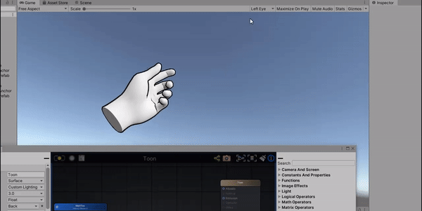

# Unity-VR-Hand-Tracking-Template
## A Unity Oculus Quest VR Hand Tracking Template
### For Unity 2019.3.0f6

Just set your target platform to Android, install the Oculus Integration off the asset store and you're ready to go!

This project is optimized for best performance for built Oculus Quest apps:

- Stock renderer in linear lighting with forward rendering
- Amplify and Oculus Integration already in Gitignore
- Stock modular kit with prefabs already set up
- Build settings, Graphics/Quality and Compression settings good to go for the Quest.

Remember you can always use [Sidequest](https://sidequestvr.com/#/) to push your homebrew stuff onto the headet.

[For More Optimization Tips](https://developer.oculus.com/blog/tech-note-unity-settings-for-mobile-vr/)
